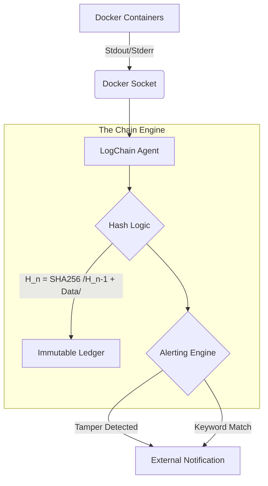

# LogChain: A Tamper-Evident Docker Logging System

LogChain is a lightweight security tool that provides tamper-evident logging for Docker environments. It continuously monitors container logs, cryptographically chains each log entry using SHA-256, and alerts administrators when suspicious activity or log tampering is detected.

The system is designed for homelabs, edge devices, and small servers where maintaining trustworthy logs is critical but traditional SIEM infrastructure is too heavy.

## Architecture

## Quick Start

TODO

## Contributing

TODO

## License

This project is licensed under the [MIT License](LICENSE).

