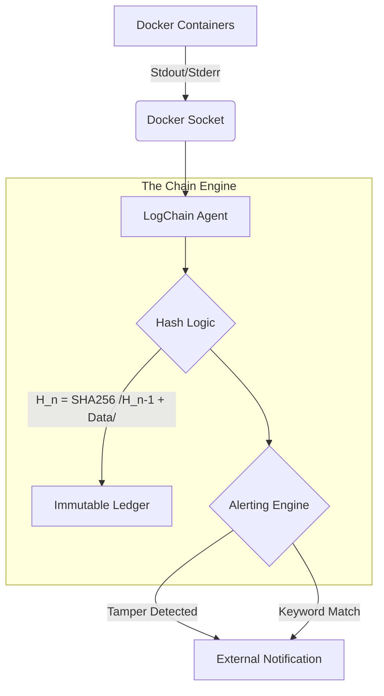

# LogChain: A Lightweight and Secure Docker Historian

LogChain is a lightweight security tool that provides tamper-evident logging for Docker environments. It continuously monitors container logs, cryptographically chains each log entry to preserve an immutable record, and alerts administrators when suspicious activity or log tampering is detected.

The system is designed for homelabs, edge devices, and small servers where maintaining trustworthy logs is critical but ease of use and flexibility is desired.


## Architecture




## Quick Start

Edit the docker-compose.yml file to your liking. You can configure log levels, alerting rules, and storage paths. To test and startup, you can use:
```yaml
services:
  logchain-web:
    build: .
    ports:
      - "5000:5000"
    container_name: logchain_web
    restart: unless-stopped
```

Ensure you have Docker (and Docker Compose) installed. Run:
```sh
docker-compose up --build
```

Once the container is running, LogChain will begin indexing existing logs and watching for new events. You can view the web interface at http://localhost:5000. Run `docker-compose down` when finished.


## Contributing

See [CONTRIBUTING](CONTRIBUTING).


## License

This project is licensed under the [MIT License](LICENSE).


## AI Disclosure

AI assistance was used in styling the webpages **only**. Nothing else was vibe coded.
