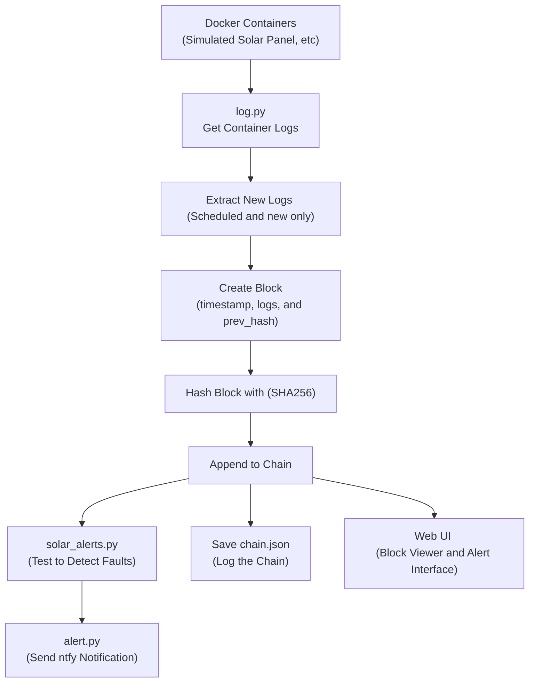

# LogChain: A Docker Historian and Alerting System


LogChain continuously monitors Docker container logs, cryptographically chains each log entry to preserve an immutable record, and alerts administrators when suspicious activity or log tampering is detected.

This system provides three main features that make it unique from other solutions:
1. Written in Python and runs in [Docker](https://www.docker.com/), providing flexibility for small servers, edge devices, and [homelabs](https://github.com/austindriggs/homelab/).
2. Provides hashing using [hashlib](https://docs.python.org/3/library/hashlib.html) (SHA-265), a user interface using [Flask](https://flask.palletsprojects.com/) and an alerting system using [ntfy](https://ntfy.sh/).
3. Free and open sourced, allowing users and admins to preserve, backup, and restore their data as they please.


## ARCHITECTURE




## QUICK START

Edit the docker-compose.yml file to your liking. You can configure log levels, alerting rules, and storage paths. To test and startup, you can use:
```yaml
services:
  logchain-web:
    build: .
    ports:
      - "5000:5000"
    container_name: logchain_web
    restart: unless-stopped
```

Also create your own `.env` file:
```bash
cp .env-example .env
```

Ensure you have Docker (and Docker Compose) installed. Run:
```sh
docker-compose up --build
```

Once the container is running, LogChain will begin indexing existing logs and watching for new events. You can view the web interface at http://localhost:5000. Run `docker-compose down` when finished.


## CONTRIBUTING

See [CONTRIBUTING](CONTRIBUTING).


## LICENSE

This project is licensed under the [MIT License](LICENSE).


## AI DISCLOSURE

AI assistance was used in styling the webpages **only** (files in src/static/). Nothing else was *vibe coded*.
