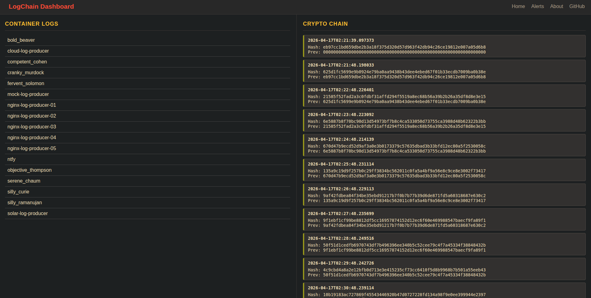
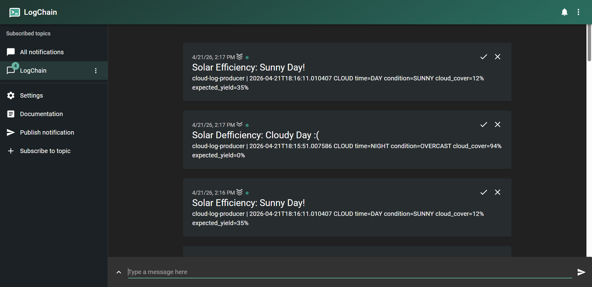
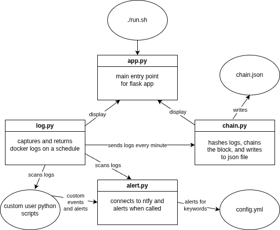

# LogChain: A Docker Historian and Alerting System


LogChain continuously monitors Docker container logs, cryptographically chains each log entry to preserve an immutable record, and alerts administrators when suspicious activity or log tampering is detected.

 \


This system provides three main features that make it unique from other solutions:
1. Written in Python and runs in [Docker](https://www.docker.com/), providing flexibility for small servers, edge devices, and [homelabs](https://github.com/austindriggs/homelab/).
2. Provides hashing using [hashlib](https://docs.python.org/3/library/hashlib.html) (SHA-265), a user interface using [Flask](https://flask.palletsprojects.com/) and an alerting system using [ntfy](https://ntfy.sh/).
3. Free and open sourced, allowing users to preserve, backup, and restore their own data as they please.

Click [here to watch the demo](https://youtu.be/lUNNUGshCoo) on YouTube!


## ARCHITECTURE




## QUICK START

You need to be in a Linux (Debian/Ubuntu) or WSL environment with Docker installed.

Run the following commands:
```bash
git clone https://github.com/austindriggs/logchain.git && cd logchain
cp .env-example .env && nano .env # to change your IP
./run.sh [sim | stop] # optional arguments
```

You can then navigate to `https://localhost:8016` to view the dashboard.


## CONTRIBUTING

See [CONTRIBUTING](CONTRIBUTING.md) to learn more about the project or fork for yourself.


## LICENSE

This project is licensed under the [MIT License](LICENSE.md).


## AI DISCLOSURE

AI assistance was used in styling the webpages **only**. Nothing else was *vibe coded*.
